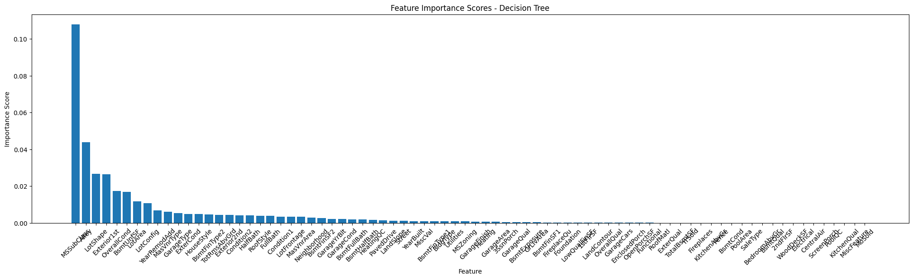
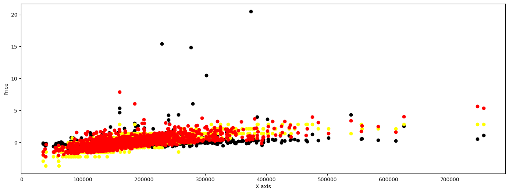
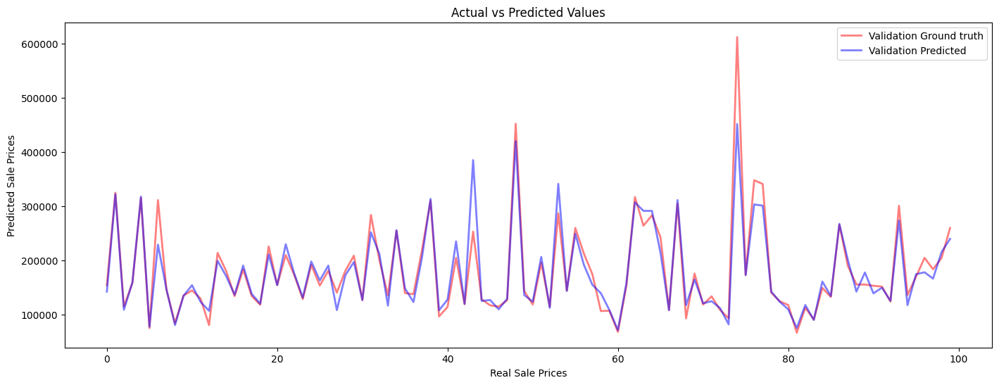

## American House Sale Regression

Predicting sale prices with 79 explanatory variables describing (almost) every aspect of residential homes in Ames, Iowa.

## 1. House Analysis 
In the correlation histogram below, we observe what are the most significant features that correlate with $\textit{Sale Price}$.   



## 2. Data preprocessing 
The data was imputed and scaled. 


## 3. Feature selection and extraction
All features were sorted and extracted a selected number for constructing the training set.

## 4. Model Selection and Training

An ensemble model with the following hyper-parameters: 
```
=========================================================================================================================================================================
[XGB]:	0.1261245403511619		{'colsample_bytree': 0.9, 'eval_metric': 'rmse', 'learning_rate': 0.06, 'max_depth': 3, 'n_estimators': 270, 'reg_lambda': 0.2, 'sampling_method': 'uniform', 'subsample': 0.7, 'tree_method': 'exact'}	
=========================================================================================================================================================================
[GB]:	0.13136246917393946		{'learning_rate': 0.07, 'loss': 'huber', 'max_depth': 3, 'n_estimators': 270}	
=========================================================================================================================================================================
[LGB]:	0.13381873674774705		{'force_col_wise': True, 'learning_rate': 0.08, 'n_estimators': 100, 'num_leaves': 31, 'objective': 'regression'}
```

#
The **Machine Learning** problem designed only using $\textit{Boosting Regressions}$ as well as a pipeline for feature engineering (preprocessing, feature extracting), model selection, training and validation metrics. In the figure below, there is the **predicted regression** plot compared to true values.



